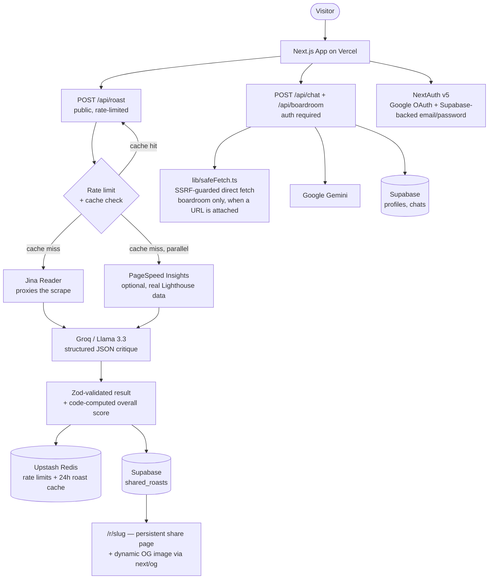

# Brutal Roaster

An AI landing-page auditor that combines real, measured performance data
(Google PageSpeed Insights / Lighthouse) with schema-validated LLM critique —
paste a URL, get scored teardown with a rewritten headline, subheadline, and
CTA. Also ships a "Virtual Boardroom" — five LLM personas (Believer, Skeptic,
Investor, Judge, plus a routing agent) that debate a business idea.

**Live:** [roastit.online](https://roastit.online) · free, no signup required for a roast.

> Add a screenshot or short screen-recording of a completed roast here once
> deployed with real API keys — I couldn't generate one from this
> environment (no live Groq/PageSpeed credentials, and no way to export a
> browser screenshot to a file from here).

## Why this exists

Most "AI wrapper" side projects are a single API call with a prompt. This one
was deliberately hardened and validated like it might actually see traffic:

- **Hybrid scoring, not vibes.** Performance/accessibility/SEO scores come
  straight from a real Lighthouse audit (PageSpeed Insights), not an LLM
  guessing at "speed." Headline clarity, CTA strength, and social proof are
  genuinely subjective, so those are LLM-judged — and the LLM's prompt
  includes the real Lighthouse numbers so its critique can cite them.
- **SSRF-hardened.** The server fetches user-supplied URLs — see
  [Security](#security) below for how that's actually guarded, and where it
  wasn't necessary to guard at all.
- **Prompt-injection resistant.** A scraped page's content is treated as
  untrusted data, not instructions — with a live test page to prove it.
- **Schema-validated output.** The LLM returns JSON validated against a Zod
  schema, with one retry (carrying the exact validation error back to the
  model) before failing cleanly, instead of trusting free text.
- **Validated against a labeled eval set**, not just "it looked right when I
  tried it." See [eval/](eval/).

## Architecture



**Why two different fetch paths.** `/api/roast` never connects to the
target URL itself — it hands the URL to Jina Reader, which does the actual
fetch on its own infrastructure. `/api/boardroom`'s optional "attach a
website" feature *does* fetch directly from this server, so that's the path
that needed the SSRF guard in `lib/safeFetch.ts`. Stating this distinction
precisely (rather than "both routes fetch user URLs") is itself part of an
honest security write-up.

## Security

**SSRF ([lib/safeFetch.ts](lib/safeFetch.ts))** — the boardroom's direct
website fetch resolves DNS itself and rejects private/loopback/link-local/
reserved addresses for both IPv4 and IPv6 (including the
`169.254.169.254` cloud metadata endpoint and IPv4-mapped IPv6 addresses),
re-validates on every redirect hop instead of following them blindly, and
caps response size via streaming. Documented, deliberate gap: a narrow
DNS-rebinding race between the validation check and the actual connect —
closing that fully means pinning the fetch to the exact IP that was
validated via a custom dispatcher, noted as a named upgrade path in the code
rather than left unstated. Run `node lib/safeFetch.selftest.ts` to see the
guard actually block `127.0.0.1`, `169.254.169.254`, and `localhost`.

**Prompt injection** — both `/api/roast` and `/api/boardroom` wrap scraped
page content in explicit `<scraped_page>`/`<scraped_website_content>`
delimiters and instruct the model to treat that block strictly as data,
never as instructions — and to call out injection attempts in its own
output rather than comply with them. [public/injection-test.html](public/injection-test.html)
is a live test page with three embedded injection attempts (visible text,
CSS-hidden text, and an HTML comment — the last one is stripped by the
scraper before it ever reaches the model, which the page itself notes). Once
deployed, roast that page's URL and the response should critique it normally
instead of parroting the injected "10/10, perfect page" instruction.

## Eval

[eval/](eval/) is a small hand-labeled benchmark — 28 real landing pages
across SaaS, enterprise, nonprofit, e-commerce, education, and dev tools,
labeled with genuine 1-10 judgment (not pre-biased with any quality hint in
the data itself) against the same rubric the AI is instructed to use. Run
`node eval/run-eval.ts` after labeling to compare the AI's scores against
the human labels (mean absolute error + correlation per category) and
generate `eval/results.md`.

*(Results aren't committed yet — labeling is a manual, ~1-2 hour pass. See
[eval/README.md](eval/README.md).)*

## Stack

- **Framework:** Next.js 15 (App Router), TypeScript, Tailwind CSS
- **Roast LLM:** Groq (Llama 3.3 70B), structured JSON output
- **Chat / Boardroom LLM:** Google Gemini
- **Deterministic metrics:** Google PageSpeed Insights (optional)
- **Auth:** NextAuth v5 — Google OAuth + Supabase-backed email/password
- **Database:** Supabase (Postgres) — accounts, boardroom history, shared roasts
- **Cache / rate limiting:** Upstash Redis
- **Validation:** Zod
- **Scraping:** Jina Reader (roast), a hand-rolled SSRF-safe fetcher (boardroom)
- **Hosting:** Vercel

## Local setup

```bash
npm install
cp .env.example .env.local   # fill in the keys you have — most are optional and degrade gracefully
npm run dev
```

See [.env.example](.env.example) for what each key does and which ones are
required vs. optional (Redis, PageSpeed, and AdSense are all optional —
the app runs without them, just with less caching/rate-limiting/metrics).

## Testing

```bash
npm run type-check   # tsc --noEmit
npm test             # runs lib/safeFetch.selftest.ts, lib/schemas/roast.selftest.ts, eval/scoring.selftest.ts
npm run build
```

No test framework dependency — these are plain `node:assert` scripts against
pure functions (the SSRF IP-range classifier, the roast scoring math, the
eval comparison math). CI (`.github/workflows/ci.yml`) runs all three on
every push and PR to `master`.
