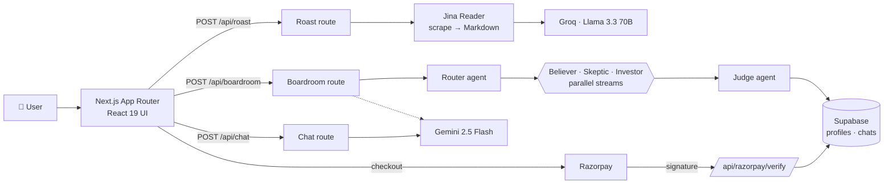

<div align="center">

# 🔥 Brutal Roaster

### AI landing page teardowns and a multi-agent startup boardroom

**Paste a URL → get a merciless conversion audit and a ready-to-ship rewrite. Pitch an idea → watch an AI board debate it and deliver a verdict.**

[](https://roastit.online)


[🌐 Live site](https://roastit.online) · [Features](#-features) · [Architecture](#-architecture) · [Tech stack](#-tech-stack) · [Getting started](#-getting-started) · [Contact](#-author)

</div>

---

## 📌 Overview

Most landing page feedback is polite, vague and useless. **Brutal Roaster** is a production SaaS that gives founders, growth marketers and agencies the honest version: it scrapes a real page, exposes what's killing conversions, and rewrites the headline, subheadline and CTA from scratch.

Beyond teardowns, the **Virtual Startup Boardroom** puts a business idea in front of a panel of AI agents with opposing incentives — then a Judge synthesises their arguments into a decisive **BUILD IT / PIVOT FIRST / DO NOT BUILD** verdict.

It's a complete product, not a demo: authentication, paid plans with server-verified payments, per-route entitlement checks, persistence, SEO, legal pages and account deletion.

---

## ✨ Features

### 🔍 Landing page teardown
- Scrapes any public URL into clean Markdown via **Jina Reader**
- **Llama 3.3 70B on Groq** returns a structured report: *The Brutal Truth · The UX Friction · The Rewrite*
- One free teardown for visitors, unlimited for paid plans

### 🏛️ Virtual Startup Boardroom — multi-agent debate
- A **router agent** decides whether the message is a business idea or a general question
- **Believer, Skeptic and Investor** agents analyse the idea **in parallel, streamed live** to the UI
- A **Judge** agent synthesises the debate into a summary, the most critical risk, and a final verdict
- Generates three sharp **follow-up questions** to keep the founder digging
- Optionally reads the startup's own website for context; conversations are saved to Supabase

### 💬 Brutal chat assistant
- Streaming Gemini chat for CRO, copywriting, pricing, funnel and business-model questions
- Markdown rendering with live token-by-token output

### 👤 Accounts, plans & payments
- **Google OAuth** and **email/password** sign-in (NextAuth v5 + Supabase Auth)
- Tiered monthly / annual plans with **Razorpay** checkout
- Settings, feedback form (email via Nodemailer) and full **account deletion**

### 🌐 Growth & polish
- Marketing homepage with a custom **WebGL scanner** background (`ogl`)
- SEO metadata, `sitemap.xml`, `robots.txt`, dynamic icon
- Privacy policy, terms, about and contact pages; AdSense integration

---

## 🏗 Architecture



### 🔐 Engineering highlights

- **Server-side entitlement on every paid API route** — a single `getEntitlement()` check guards each endpoint that spends LLM credits, so bypassing the UI paywall and calling the API directly doesn't work.
- **Tamper-proof payments** — Razorpay signatures are verified with HMAC-SHA256, and the plan and billing period are read from the server-created order, never from the client request.
- **Streaming UX** — the Boardroom and chat stream newline-delimited JSON events, and the three board agents run concurrently with `Promise.all`, cutting wait time to the slowest agent instead of the sum of all three.
- **SSRF protection** — server-side fetching of user-supplied URLs blocks localhost, private ranges and cloud metadata addresses.
- **Right model for the job** — fast, cheap Groq inference for high-volume teardowns; Gemini for long-form multi-agent reasoning.
- **Real account lifecycle** — sign-up, sign-in, plan expiry and genuine account deletion through the Supabase admin API.

---

## 🛠 Tech stack

| Layer | Technology |
|---|---|
| **Framework** | Next.js 15 (App Router, Route Handlers), React 19, TypeScript |
| **Styling** | Tailwind CSS v4, `@tailwindcss/typography`, `ogl` (WebGL) |
| **AI** | Google Gemini 2.5 Flash (`@google/generative-ai`), Groq Llama 3.3 70B (`groq-sdk`), Jina Reader |
| **Auth** | NextAuth v5 — Google OAuth + Credentials backed by Supabase Auth |
| **Database** | Supabase (Postgres) |
| **Payments** | Razorpay (orders + signature verification) |
| **Email** | Nodemailer (SMTP) |
| **Rendering** | `react-markdown` |
| **Hosting** | Vercel |

---

## 🚀 Getting started

**Prerequisites:** Node.js 20+, a Supabase project, and API keys for Gemini and Groq.

```bash
git clone https://github.com/tan8696/roastit.git
cd roastit
npm install
cp .env.example .env.local   # fill in your keys
npm run dev                  # http://localhost:3000
```

### Environment variables

| Group | Variables |
|---|---|
| **AI** | `GEMINI_API_KEY`, `GROQ_API_KEY` |
| **Site & auth** | `NEXT_PUBLIC_SITE_URL`, `NEXTAUTH_URL`, `NEXTAUTH_SECRET`, `GOOGLE_CLIENT_ID`, `GOOGLE_CLIENT_SECRET` |
| **Supabase** | `NEXT_PUBLIC_SUPABASE_URL`, `NEXT_PUBLIC_SUPABASE_ANON_KEY`, `SUPABASE_SERVICE_ROLE_KEY` |
| **Payments** | `RAZORPAY_KEY_ID`, `RAZORPAY_KEY_SECRET` |
| **Email** | `SMTP_USER`, `SMTP_PASS` |
| **Ads (optional)** | `NEXT_PUBLIC_ADSENSE_CLIENT_ID`, `NEXT_PUBLIC_ADSENSE_SLOT_ID` |

See [`.env.example`](.env.example) for descriptions of each value.

### Scripts

| Command | Description |
|---|---|
| `npm run dev` | Start the dev server on port 3000 |
| `npm run build` | Create a production build |
| `npm start` | Run the production server |

---

## 📁 Project structure

```
app/
├── api/
│   ├── roast/              # Scrape + Groq landing page teardown
│   ├── boardroom/          # Multi-agent debate (router → 3 parallel agents → judge)
│   ├── chat/               # Streaming Gemini assistant
│   ├── razorpay/           # create-order · verify
│   ├── auth/               # NextAuth handlers · signup
│   ├── user/               # Profile, entitlement, account deletion
│   └── feedback/           # Feedback email
├── boardroom/ chat/ paywall/ settings/ login/
└── about/ contact/ privacy/ terms/ sitemap.ts robots.ts
components/                 # Marketing home, dashboard, roast form, WebGL scanner…
lib/entitlement.ts          # Single source of truth for "is this user paid"
auth.ts                     # NextAuth configuration
```

---

## 🗺 Roadmap

- [ ] Ad-supported free tier
- [ ] Server-side usage metering per plan
- [ ] Exportable PDF teardown reports
- [ ] Side-by-side before/after rewrite previews

---

## 👤 Author

**Tanish Lather** — Full-stack developer

[](https://github.com/tan8696)
[](https://www.linkedin.com/in/tanish-lather-27456b40a)
[](mailto:tanishla1100@gmail.com)

💼 *Open to freelance and full-time opportunities — feel free to reach out.*

---

## 📄 License

Proprietary — all rights reserved.
